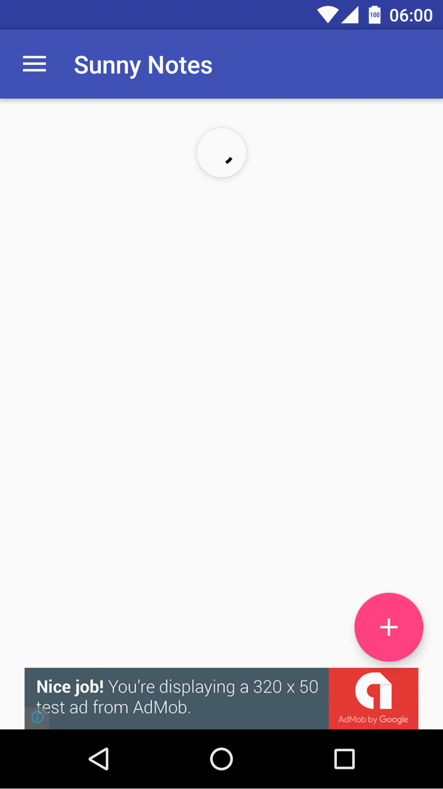

# Sunny Notes, Capstone project

## Android Developer Nanodegree

### Requirements

* Dropbox API
* Test dropbox user account
* Analytics API
* AdMob

There are guides below that discribe how to get them.

#### Dropbox API

Create Dropbox API key:

0. Open the following link: https://www.dropbox.com/developers/apps
1. Click button "Create app", 
2. Choose an API: Dropbox API.
3. Choose the type of access you need: App folder.
4. Name your app: input any name.
5. Put a generated "App key" in the global "gradle.properties".

An example of "gradle.properties" App Key: "l1************z".

An example of "gradle.properties" file
```
DropboxAppKey="db-l1************z"
DropboxAppKeyJava="l1************z"
```

---

#### Test dropbox user account

email: denis6308@gmail.com

pass: rrrrrr

---

#### Analytics API

You could generate a google services configuration file ("google-services.json") with enabled analytics by the following link:
https://developers.google.com/mobile/add?platform=android&cntapi=analytics&cnturl=https:%2F%2Fdevelopers.google.com%2Fanalytics%2Fdevguides%2Fcollection%2Fandroid%2Fv4%2Fapp%3Fconfigured%3Dtrue&cntlbl=Continue%20Adding%20Analytics

When put the configuration file in the app folder ("capstone_project\SunnyNotes\app").

You could find more info about that process from the following tutorial:
https://developers.google.com/analytics/devguides/collection/android/v4/#set-up-your-project

---

#### AdMob 

You can add test device id into the "res/values/strings.xml" file.

```
<string name="ad_mob_test_device">put id here</string>
```

---

### Screenshots

